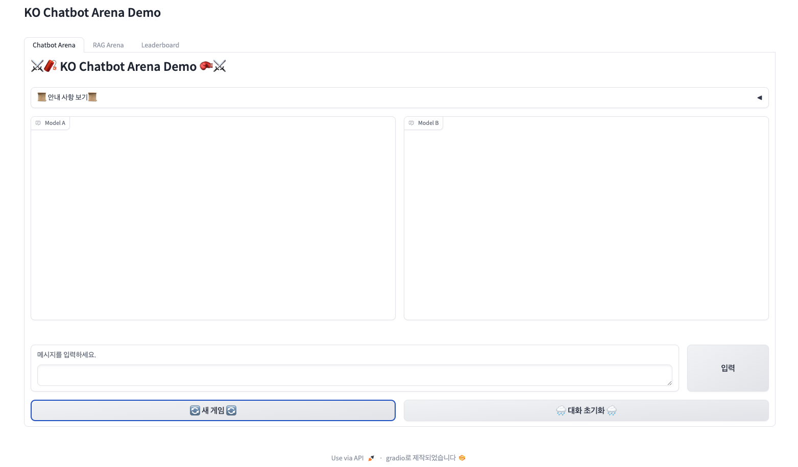
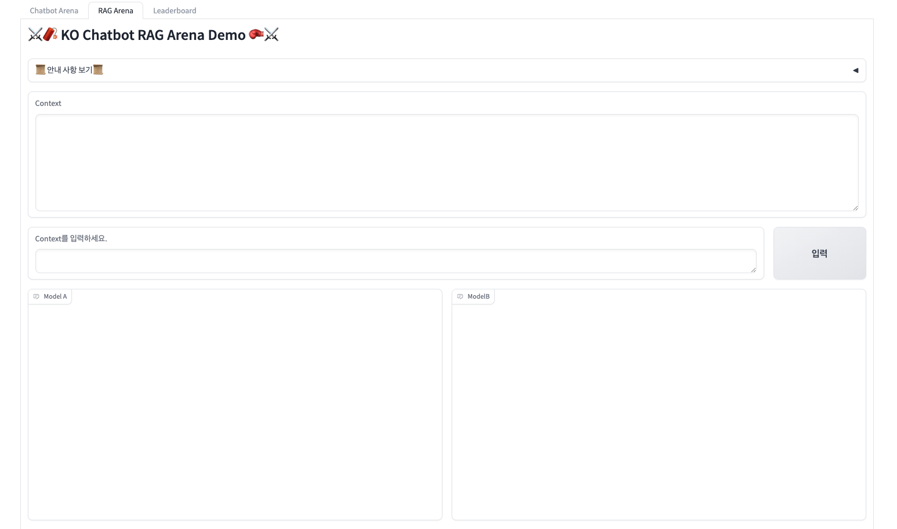
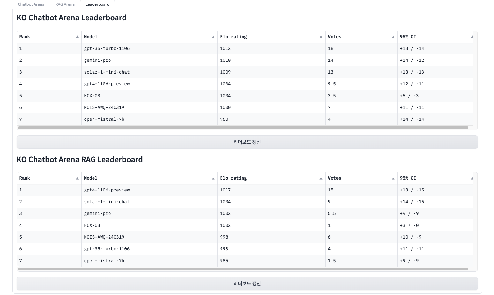

# KO Chatbot Arena(RAG) Leaderboard

## 해결하고 싶은 문제
1. 한국어 LLM 리더보드 성능이 높은데, 한국어를 잘 못하는 모델이 많음.
2. 내가 개발하려는 서비스에 어떤 모델의 적합할지, LLM 리더보드로는 알수 없음.

## 해결방안 
1. 과거에 만들어진 test set이 아닌 현재 사용자의 경험을 통해 평가 받는 리더보드
2. 서비스에 자주 사용 기능들을 각각 평가

## 구현 방안
1. 기능 별 블라인드 테스트
2. 테스트 데이터 누적 후 RAW 데이터 허깅페이스에 공개 -> 자동화
3. Elo Rating System 기반 리더보드 구축

### Demo
1. 한국어 LLM chatbot arena

2. 한국어 RAG arena

3. ELO rating 리더보드

reference

- lmsys chatbot arena

  https://huggingface.co/spaces/lmsys/chatbot-arena-leaderboard
